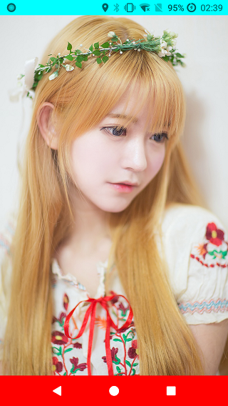
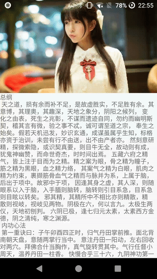

# UltimateBarX
一款方便的设置状态栏和导航栏的各种效果的框架

详细介绍：[这就是 github 上最好用的 Android 状态栏导航栏库](https://juejin.cn/post/6903165109485436935)

> * 可以设置各种效果，透明、半透明、固定颜色、布局是否侵入等
> * 状态栏和导航栏分开设置，互不影响
> * 支持 Android 4.4 以上，各系统版本的现实效果高度统一
> * 支持 Activity 和 Fragment
> * 同一个 Activity 或 Fragment 可以多次设置不同的效果
> * 适配刘海屏、滴水屏、挖孔屏、全面屏
> * 适配 miui、emui、funtouch 等 rom

### 使用方法
在 gradle 中添加
```groovy
dependencies {
    implementation 'com.zackratos.ultimatebarx:ultimatebarx:0.3.2'
}
```

在 Activity 或 Fragment 中
```kotlin
val config = BarConfig.newInstance()          // 创建配置对象
    .fitWindow(true)                          // 布局是否侵入状态栏（true 不侵入，false 侵入）
    .color(Color.RED)                         // 状态栏背景颜色（色值）
    .colorRes(R.color.deepSkyBlue)            // 状态栏背景颜色（资源id）
    .drawableRes(R.drawable.bg_gradient)      // 状态栏背景 drawable
    .light(false)                             // light模式
                                              // 状态栏字体 true: 灰色，false: 白色 Android 6.0+
                                              // 导航栏按钮 true: 灰色，false: 白色 Android 8.0+

UltimateBarX.with(this)                       // 对当前 Activity 或 Fragment 生效
    .config(config)                           // 使用配置
    .applyStatusBar()                         // 应用到状态栏
    
UltimateBarX.with(this)                       // 对当前 Activity 或 Fragment 生效
    .config(config)                           // 使用配置
    .applyNavigationBar()                     // 应用到导航栏
```

也可以直接链式调用
```kotlin
UltimateBarX.with(this)
    .fitWindow(true)  
    .color(Color.BLACK)
    .colorRes(R.color.deepSkyBlue)
    .drawableRes(R.drawable.bg_gradient)
    .light(false)
    .applyStatusBar()
```

使用 `transparent` 方法可以快速设置透明效果
```kotlin
UltimateBarX.with(this)
    .transparent()
    .applyStatusBar()
```

跟下面的写法效果是一样的
```kotlin
UltimateBarX.with(this)
    .fitWindow(false)
    .color(Color.TRANSLUCENT)
    .applyStatusBar()
```

使用 `get` 方法可以在上一次的基础上修改  

例如，先用下面的代码实现状态栏变红色，不侵入，非 light 模式
```kotlin
UltimateBarX.with(this)
    .color(Color.RED)
    .fitWindow(true)
    .light(false)
    .applyStatusBar()
```

然后需要设置 light 模式，其他效果保持不变，直接用下面的方法即可
```kotlin
UltimateBarX.get(this)
    .light(true)
    .applyStatusBar()
```

### 截图
　

　

　

### Change Log
[CHANGELOG](CHANGELOG.md)

### License
```
Copyright 2020 Zackratos

Licensed under the Apache License, Version 2.0 (the "License");
you may not use this file except in compliance with the License.
You may obtain a copy of the License at

    http://www.apache.org/licenses/LICENSE-2.0

Unless required by applicable law or agreed to in writing, software
distributed under the License is distributed on an "AS IS" BASIS,
WITHOUT WARRANTIES OR CONDITIONS OF ANY KIND, either express or implied.
See the License for the specific language governing permissions and
limitations under the License.
```